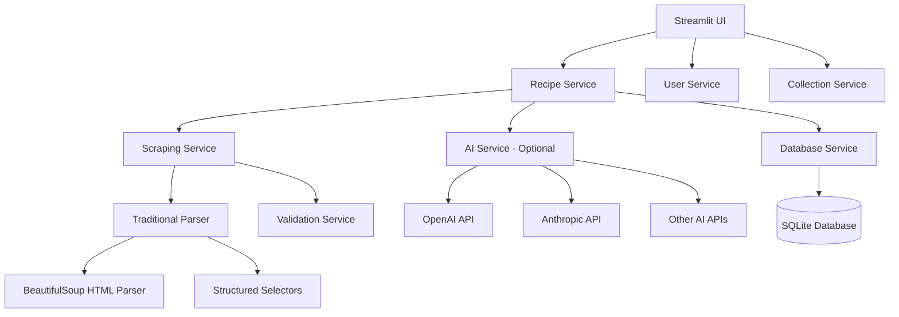

# Design Document

## Overview

Pans Cookbook is a web-based recipe management application built with Streamlit that adapts the proven architecture of the Herbalism app for culinary recipes. The system uses traditional web scraping with manual validation forms for reliable data acquisition, while offering optional AI integration for recipe variations and suggestions through user-provided API keys.

The architecture prioritizes modularity and reliability by separating core functionality (recipe browsing, filtering, scraping) from optional AI features, ensuring the application works consistently for all users while enabling enhanced features for those who choose to configure AI services.

## Steering Document Alignment

### Technical Standards (tech.md)
The design follows established Python patterns with clean separation of concerns, using proven libraries (Streamlit, SQLite, BeautifulSoup) and defensive programming practices for web scraping operations.

### Project Structure (structure.md)  
Implementation follows the modular structure established in the Herbalism app with clear separation between data models, services, UI components, and optional AI integration layers.

## Code Reuse Analysis

### Existing Components to Leverage
- **Database Architecture**: Adapt `database.py` dataclass patterns and SQLite operations from Herbalism app
- **Streamlit UI Patterns**: Reuse layout, styling, and state management patterns from `app.py`
- **Scraping Framework**: Extend `scraper.py` structure with robots.txt compliance and rate limiting
- **Service Layer**: Adapt the modular service architecture from `src/scraper/` directory

### Integration Points
- **SQLite Database**: Extend existing schema patterns for recipe-specific data models
- **CSV Import/Export**: Leverage existing data loading patterns for recipe and ingredient management
- **Logging System**: Reuse scraper logging infrastructure for debugging and monitoring
- **Validation Patterns**: Adapt herb validation logic for recipe data validation

## Architecture

The application follows a layered architecture with clear separation between data, business logic, and presentation layers:

### Modular Design Principles
- **Single File Responsibility**: Each service handles one domain (scraping, parsing, AI integration, user management)
- **Component Isolation**: Web scraping operates independently from AI services and database operations
- **Service Layer Separation**: Clear boundaries between data access, business logic, and UI presentation
- **Optional Dependencies**: AI services are completely optional and don't affect core functionality



## Components and Interfaces

### Recipe Service
- **Purpose:** Core business logic for recipe management and filtering
- **Interfaces:** 
  - `get_recipes_by_ingredients(ingredient_ids: List[int]) -> List[Recipe]`
  - `create_recipe(recipe_data: RecipeData, user_id: int) -> Recipe`
  - `validate_scraped_recipe(scraped_data: ScrapedRecipe) -> ValidationResult`
- **Dependencies:** Database Service, Validation Service
- **Reuses:** Database patterns from Herbalism app, filtering logic

### Scraping Service
- **Purpose:** Web scraping with traditional HTML parsing and validation
- **Interfaces:**
  - `scrape_recipe_url(url: str) -> ScrapedRecipe`
  - `parse_recipe_structured(html: str, url: str) -> ParsedRecipe`
  - `validate_robots_txt(url: str) -> bool`
- **Dependencies:** BeautifulSoup, requests, robots.txt parser
- **Reuses:** Existing scraper framework, rate limiting, error handling

### User Service
- **Purpose:** User account management and authentication
- **Interfaces:**
  - `authenticate_user(email: str, password: str) -> UserSession`
  - `store_api_key(user_id: int, service: str, encrypted_key: str) -> bool`
  - `get_user_preferences(user_id: int) -> UserPreferences`
- **Dependencies:** Database Service, encryption utilities
- **Reuses:** Session state management patterns from Streamlit

### AI Service (Optional)
- **Purpose:** Recipe variations and suggestions using external APIs
- **Interfaces:**
  - `generate_recipe_variations(recipe: Recipe, user_preferences: dict) -> List[RecipeVariation]`
  - `suggest_recipes(ingredients: List[str], api_config: APIConfig) -> List[RecipeSuggestion]`
  - `validate_api_key(service: str, api_key: str) -> bool`
- **Dependencies:** External AI APIs, user-provided API keys
- **Reuses:** None (new component)

### Validation Service
- **Purpose:** Manual validation forms and data correction interfaces
- **Interfaces:**
  - `create_validation_form(scraped_data: ScrapedRecipe) -> ValidationForm`
  - `process_validation_input(form_data: dict) -> ValidatedRecipe`
  - `suggest_ingredient_matches(ingredient_name: str) -> List[Ingredient]`
- **Dependencies:** Database Service for ingredient matching
- **Reuses:** Data validation patterns from Herbalism app

### Collection Service
- **Purpose:** Recipe favorites and meal collection management
- **Interfaces:**
  - `create_collection(name: str, user_id: int) -> Collection`
  - `add_recipe_to_collection(recipe_id: int, collection_id: int) -> bool`
  - `generate_shopping_list(collection_id: int) -> ShoppingList`
- **Dependencies:** Database Service
- **Reuses:** Database relationship patterns

## Data Models

### Recipe
```python
@dataclass
class Recipe:
    id: int
    name: str
    description: str
    instructions: str
    prep_time_minutes: int
    cook_time_minutes: int
    servings: int
    difficulty_level: str  # easy, medium, hard
    cuisine_type: str
    meal_category: str  # breakfast, lunch, dinner, snack, dessert
    dietary_tags: List[str]  # vegetarian, vegan, gluten-free, etc.
    nutritional_info: Optional[NutritionData]
    created_by: int  # user_id
    created_at: datetime
    source_url: Optional[str]
```

### Ingredient
```python
@dataclass  
class Ingredient:
    id: int
    name: str
    category: str  # protein, vegetable, spice, dairy, etc.
    common_substitutes: List[str]
    storage_tips: str
    nutritional_data: Optional[NutritionData]
```

### RecipeIngredient  
```python
@dataclass
class RecipeIngredient:
    recipe_id: int
    ingredient_id: int
    quantity: float
    unit: str  # cup, tablespoon, gram, etc.
    preparation_note: str  # diced, minced, optional, etc.
    ingredient_order: int  # for display ordering
```

### User
```python
@dataclass
class User:
    id: int
    email: str
    password_hash: str
    api_keys: Dict[str, str]  # encrypted API keys by service
    preferences: UserPreferences
    created_at: datetime
    last_login: datetime
```

### Collection
```python
@dataclass
class Collection:
    id: int
    name: str
    description: str
    user_id: int
    recipe_ids: Set[int]
    is_public: bool
    created_at: datetime
    updated_at: datetime
```

## Error Handling

### Error Scenarios
1. **Scraping Failures:**
   - **Handling:** Graceful degradation with detailed error messages and manual entry fallback
   - **User Impact:** Clear error explanation with suggested next steps (try different URL, manual entry)

2. **API Rate Limiting:**
   - **Handling:** Exponential backoff with user notification and queue management
   - **User Impact:** Progress indicator with estimated wait time

3. **Invalid Recipe Data:**
   - **Handling:** Validation form highlights problematic fields with suggested corrections
   - **User Impact:** Intuitive form interface to fix issues before saving

4. **AI Service Unavailable:**
   - **Handling:** Feature gracefully disabled with clear messaging, core functionality unaffected
   - **User Impact:** App continues working normally, AI features marked as unavailable

5. **Database Connection Issues:**
   - **Handling:** Retry logic with local caching and user notification
   - **User Impact:** Temporary offline mode for browsing cached recipes

## Testing Strategy

### Unit Testing
- **Recipe filtering logic** with various ingredient combinations and edge cases
- **Web scraping parsers** with mock HTML responses from common recipe sites
- **Data validation functions** with malformed and edge-case recipe data
- **API key encryption/decryption** with various key formats and invalid inputs

### Integration Testing
- **Complete scraping workflow** from URL input through validation form to database storage
- **User authentication flow** including API key storage and retrieval
- **Recipe collection management** including sharing and export functionality
- **AI service integration** with mock API responses and error conditions

### End-to-End Testing
- **Recipe discovery workflow** - scraping, validation, saving, and finding recipes by ingredients
- **Multi-user scenarios** - different users with different API keys and preferences  
- **Collection sharing** - creating, sharing, and importing recipe collections
- **Cross-device synchronization** - accessing same account from different devices

### Manual Testing Focus Areas
- **Validation form usability** - ensuring drag-and-drop ingredient categorization is intuitive
- **Mobile responsiveness** - recipe browsing and filtering on various screen sizes
- **Scraping accuracy** - testing with popular recipe websites for parsing reliability
- **AI integration UX** - ensuring optional AI features don't confuse users who don't use them