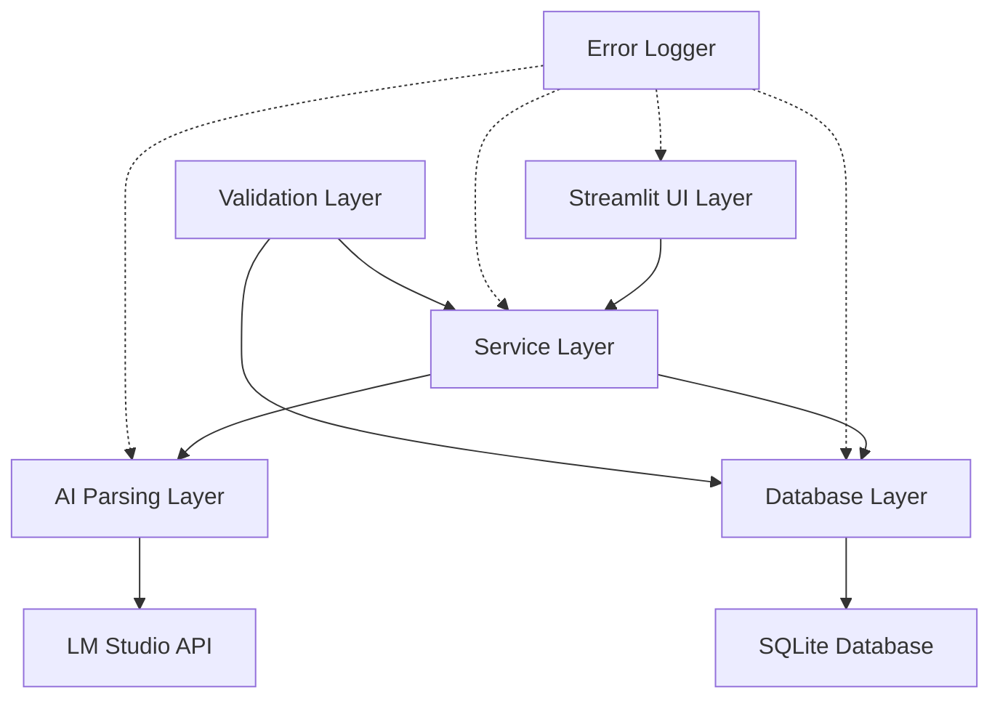

# Design Document

## Overview

The Enhanced Scraper System transforms the current scraper_ui.py into a production-ready intelligent parsing system with comprehensive database integration. The design emphasizes **transparent error handling** where fallbacks never mask underlying issues, comprehensive logging for debugging, and modular architecture that separates concerns while maintaining data integrity. The system will seamlessly integrate with the existing SQLite database architecture while providing enhanced AI-powered parsing capabilities for both recipes and herbs.

## Steering Document Alignment

### Technical Standards
Following Python best practices with clear separation of concerns, comprehensive error handling, and database-first approach using the existing SQLite architecture.

### Project Structure  
Building upon the existing codebase structure with database.py models and integrating with the current Streamlit application architecture.

## Code Reuse Analysis

### Existing Components to Leverage
- **database.py**: Herb and Recipe dataclasses, SQLite connection management, migration functions
- **scraper_ui.py**: Basic scraping logic, LM Studio integration, Streamlit UI framework  
- **app.py**: UI patterns, error display, database loading patterns

### Integration Points
- **SQLite Database**: Direct integration with existing herbs and recipes tables
- **LM Studio**: Existing OpenAI client configuration and prompt patterns
- **Streamlit UI**: Consistent styling and user interaction patterns

## Architecture

The system follows a layered architecture with explicit error propagation and comprehensive logging to ensure **no errors are hidden by fallbacks**:



### Modular Design Principles
- **Single File Responsibility**: Each module handles one specific domain (parsing, validation, database operations)
- **Component Isolation**: AI parsing, database operations, and UI are completely separate with clean interfaces
- **Service Layer Separation**: Business logic isolated from presentation and data access
- **Transparent Error Propagation**: All errors are logged AND displayed to users with context

## Components and Interfaces

### ScraperService (NEW)
- **Purpose:** Orchestrates the complete scraping workflow from URL to database storage
- **Interfaces:** 
  - `scrape_and_save_recipe(url: str) -> ScrapingResult`
  - `parse_and_save_recipe(text: str) -> ScrapingResult`
- **Dependencies:** AIParsingService, DatabaseService, ValidationService
- **Error Handling:** Logs all errors, provides detailed failure context, never silently fails

### AIParsingService (NEW) 
- **Purpose:** Handles all AI-powered parsing for recipes and herbs with comprehensive error reporting
- **Interfaces:**
  - `parse_recipe(text: str) -> ParsedRecipe`
  - `extract_herb_info(herb_name: str) -> ParsedHerb`
  - `validate_parsed_data(data: dict) -> ValidationResult`
- **Dependencies:** LM Studio OpenAI client
- **Error Handling:** **CRITICAL - No fallback masking**: All AI failures are exposed with full error details, malformed responses are logged with exact content for debugging

### DatabaseService (NEW)
- **Purpose:** Manages all database operations with transaction safety and detailed error reporting
- **Interfaces:**
  - `save_recipe_with_herbs(recipe: ParsedRecipe, herbs: List[ParsedHerb]) -> DatabaseResult`
  - `find_similar_herbs(herb_name: str, scientific_name: str) -> List[Herb]` 
  - `create_herb_if_not_exists(herb_data: ParsedHerb) -> Herb`
- **Dependencies:** database.py models and connection
- **Error Handling:** Transaction rollback on any failure, detailed SQL error logging, constraint violation reporting

### ValidationService (NEW)
- **Purpose:** Validates all data before database storage with safety checks
- **Interfaces:**
  - `validate_recipe_data(recipe: ParsedRecipe) -> ValidationResult`
  - `validate_herb_safety(herb: ParsedHerb) -> SafetyValidationResult`  
  - `check_for_dangerous_content(text: str) -> SafetyWarning[]`
- **Dependencies:** None (pure validation logic)
- **Error Handling:** **Never fails silently** - all validation failures are reported with specific field-level details

### Enhanced ScraperUI (MODIFIED)
- **Purpose:** Streamlit interface with comprehensive error display and user feedback
- **Interfaces:** Enhanced Streamlit components with detailed progress tracking
- **Dependencies:** ScraperService, existing database loading
- **Error Handling:** **Transparent error display** - shows both user-friendly messages AND technical details for debugging

## Data Models

### ParsedRecipe (NEW)
```python
@dataclass
class ParsedRecipe:
    name: str
    description: str
    instructions: str
    benefits: str
    category: str
    route: str
    safety_summary: str
    contraindications: str
    interactions: str
    pediatric_note: str
    pregnancy_note: str
    sanitation_level: str
    storage_instructions: str
    shelf_life_days: int
    batch_size_value: float
    batch_size_unit: str
    ingredients: List[str]
    unknown_herbs: List[str]
```

### ParsedHerb (NEW)
```python
@dataclass 
class ParsedHerb:
    name: str
    description: str
    scientific_name: str
    traditional_uses: str
    craft_uses: str
    current_evidence_summary: str
    contraindications: str
    interactions: str
    toxicity_notes: str
    symbol: str = "🌿"
```

### ScrapingResult (NEW)
```python
@dataclass
class ScrapingResult:
    success: bool
    recipe_id: Optional[int]
    new_herbs_added: List[int] 
    errors: List[str]
    warnings: List[str]
    debug_info: Dict[str, Any]  # For detailed error analysis
```

### ValidationResult (NEW)
```python
@dataclass
class ValidationResult:
    is_valid: bool
    field_errors: Dict[str, List[str]]
    safety_warnings: List[str]
    critical_issues: List[str]
```

## Error Handling

### **CRITICAL: No Error Masking Policy**

The system follows a **"No Silent Failures"** policy where fallbacks never hide the underlying problems:

### Error Scenarios with Transparent Handling

1. **AI Parsing Failures**
   - **Handling:** Log exact AI response, display parsing error to user, show raw response for debugging
   - **User Impact:** Clear error message with option to manually edit or retry
   - **NO FALLBACK MASKING:** Never use empty defaults that hide parsing failures

2. **Database Constraint Violations**
   - **Handling:** Full transaction rollback, detailed constraint error logging, specific field validation feedback
   - **User Impact:** Exact field-level error messages with suggested corrections
   - **NO FALLBACK MASKING:** Never silently skip invalid records

3. **Network/API Timeouts**
   - **Handling:** Detailed timeout logging with duration and endpoint info, retry mechanism with backoff
   - **User Impact:** Clear timeout message with retry options and status
   - **NO FALLBACK MASKING:** Never proceed with partial data from timeouts

4. **Herb Matching Ambiguity** 
   - **Handling:** Log all potential matches, present disambiguation UI to user
   - **User Impact:** Clear choice interface with detailed herb information
   - **NO FALLBACK MASKING:** Never auto-select ambiguous matches

### Error Logging Strategy
```python
# Example error logging approach
import logging
from typing import Dict, Any

class ScraperLogger:
    def log_ai_parsing_error(self, input_text: str, ai_response: str, error: Exception, context: Dict[str, Any]):
        logging.error(f"AI Parsing Failed: {error}")
        logging.error(f"Input length: {len(input_text)}")  
        logging.error(f"AI Response: {ai_response[:500]}...")
        logging.error(f"Context: {context}")
        # Also save to debug file for analysis
        
    def log_database_error(self, operation: str, data: Dict[str, Any], sql_error: Exception):
        logging.error(f"Database operation '{operation}' failed: {sql_error}")
        logging.error(f"Data being processed: {data}")
        # Never continue without understanding why it failed
```

## Testing Strategy

### Unit Testing
- **AIParsingService**: Mock LM Studio responses, test JSON parsing edge cases, verify error propagation
- **DatabaseService**: Test transaction rollbacks, constraint violations, connection failures  
- **ValidationService**: Test safety validation rules, field validation logic, edge cases

### Integration Testing
- **Complete scraping workflow**: URL → parsing → validation → database storage
- **Error propagation testing**: Verify errors bubble up correctly through all layers
- **Database consistency testing**: Verify rollback behavior under various failure conditions

### End-to-End Testing
- **Success scenarios**: Complete recipe scraping with new herb discovery
- **Failure scenarios**: Network failures, malformed AI responses, database conflicts
- **Error visibility testing**: Verify all errors are properly displayed to users

## Advanced LM Studio Integration

### Enhanced Recipe Parsing Prompt
```python
RECIPE_PARSING_PROMPT = """
You are an expert Herbal Recipe Parser. Extract recipe information with STRICT field mapping.

CRITICAL: If you cannot confidently determine a field value, use an empty string rather than guessing.

Required JSON structure with ALL fields:
{
  "name": "exact recipe name",
  "description": "brief description", 
  "instructions": "step by step with \\n separators",
  "benefits": "health/therapeutic benefits",
  "category": "Remedy|Salve|Balm|Shampoo|Tea|Tincture|Syrup|Poultice|Compress|Rinse",
  "route": "topical|oral|otic|inhaled|rinse|compress",
  "safety_summary": "general safety notes",
  "contraindications": "when NOT to use",
  "interactions": "drug/supplement interactions",
  "pediatric_note": "children-specific guidance", 
  "pregnancy_note": "pregnancy-specific guidance",
  "sanitation_level": "sterile|clean|basic hygiene requirements",
  "storage_instructions": "how to store finished product",
  "shelf_life_days": 0,
  "batch_size_value": 0.0,
  "batch_size_unit": "ml|oz|cups|servings",
  "ingredients": ["ingredient 1", "ingredient 2"],
  "unknown_herbs": ["herbs not in standard databases"]
}

SAFETY RULES:
- Never invent contraindications or interactions
- Flag any potentially dangerous instructions
- Mark uncertain information clearly
- Use empty strings for unknown fields
"""
```

### Herb Information Extraction Prompt
```python
HERB_EXTRACTION_PROMPT = """
You are an expert herbalist extracting comprehensive herb information.

Extract information for herb: {herb_name}

Required JSON structure:
{
  "name": "common name",
  "description": "physical description and growing info",
  "scientific_name": "Latin binomial name", 
  "traditional_uses": "historical medicinal uses",
  "craft_uses": "cosmetic, soap, potpourri applications",
  "current_evidence_summary": "modern research summary",
  "contraindications": "when to avoid",
  "interactions": "known interactions", 
  "toxicity_notes": "safety concerns"
}

SAFETY REQUIREMENTS:
- Only include well-documented information
- Flag uncertain or controversial claims
- Never minimize safety concerns
- Use empty strings for unverified information
"""
```

## Implementation Priority

1. **Core Services Layer** - Build service classes with comprehensive error handling
2. **Database Integration** - Implement transaction-safe database operations  
3. **AI Parsing Enhancement** - Upgrade prompts and response handling
4. **Validation Layer** - Implement safety and data validation
5. **UI Enhancement** - Add comprehensive error display and progress tracking
6. **Testing & Debugging** - Comprehensive test coverage with error scenario testing

This design ensures that **no errors are hidden by fallbacks** while providing a robust, maintainable system for intelligent recipe and herb management.